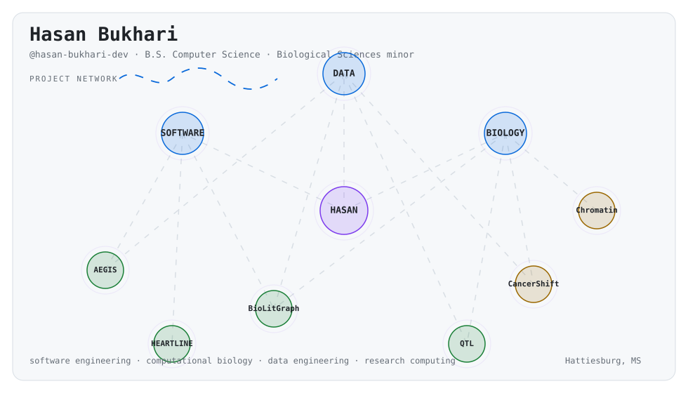

<picture>
  <source media="(prefers-color-scheme: dark)" srcset="./assets/network-dark.svg">
  <source media="(prefers-color-scheme: light)" srcset="./assets/network-light.svg">
  
</picture>

  <strong>Computer Science · Computational Biology · Data</strong> 
  University of Southern Mississippi · B.S. Computer Science · Biological Sciences minor

  <a href="https://glitchmatrix-jpg.github.io/hasan-bukhari-portfolio/">Portfolio</a>
  ·
  <a href="https://www.linkedin.com/in/hasan-bukhari">LinkedIn</a>
  ·
  <a href="mailto:hasan.bukhari.dev@gmail.com">Email</a>

---

## Selected work

<strong>AEGIS</strong> — controlled-document intelligence and governance

Deterministic change detection, trusted state, review workflows, and audit history.

`Python` · `FastAPI` · `React` · `TypeScript` · `SQLite`

[Repository](https://github.com/glitchmatrix-jpg/AEGIS)

<strong>BioLitGraph</strong> — biomedical literature to structured evidence

Biomedical literature retrieval, entity normalization, evidence-network construction, and structured export.

`Python` · `Flask` · `PubMed` · `PubTator` · `NetworkX`

<strong>CancerShift</strong> — cancer classification under dataset shift

Cross-platform cancer tissue-of-origin classification evaluated across TCGA, GEO, and CPTAC datasets.

`Python` · `scikit-learn` · `pandas`

<strong>Chromatin Contact Prediction</strong> — epigenomics to Hi-C

Hi-C contact prediction from epigenomic signals with chromosome-level holdouts and leakage-aware evaluation.

`Python` · `PyTorch` · `Hi-C` · `epigenomics`

<strong>HEARTLINE</strong> — native Android lyric companion

Native Android synchronized-lyrics companion.

`Kotlin` · `Android`

[Repository](https://github.com/glitchmatrix-jpg/HEARTLINE-Android)

<strong>QTL Analysis Toolkit</strong> — statistical genomics tooling

QTL scans, LOD analysis, genotype/phenotype processing, visualization, and spreadsheet export.

`Python` · `pandas` · `Matplotlib` · `OpenPyXL`

---

## Core tools

  

Profile visual generated from code in this repository.

